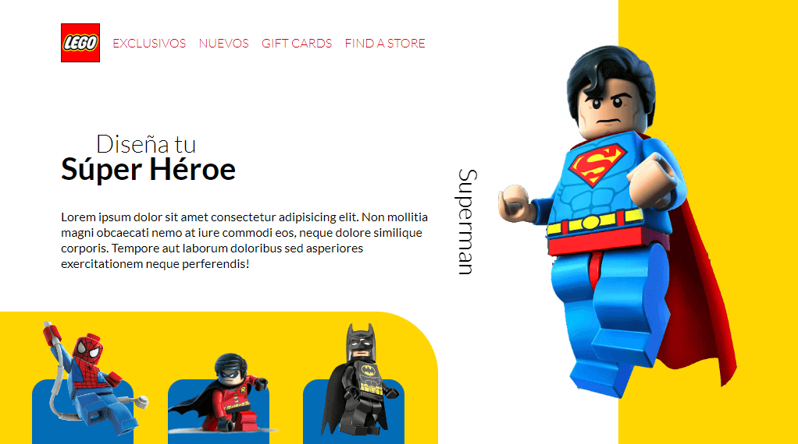

<h1>Curso Practico de Maquetación y Animaciones con CSS 2021 🧩</h1>

# Tabla de contenido 📖

- [Tabla de contenido 📖](#tabla-de-contenido-)
- [Introducción 📝](#introducción-)
- [Objetivo 🎯](#objetivo-)
- [Herramientas 🛠️](#herramientas-️)
- [Resultado 🚀](#resultado-)
- [¿Cómo ejecutar el proyecto localmente? 💻](#cómo-ejecutar-el-proyecto-localmente-)
- [Licencia 📄](#licencia-)
- [Tecnologías usadas 🧑‍💻](#tecnologías-usadas-)
  - [Lenguajes de programación](#lenguajes-de-programación)
  - [Hoja de estilos](#hoja-de-estilos)
  - [Estructura web](#estructura-web)
  - [Linters y formatters](#linters-y-formatters)
  - [Empaquetador](#empaquetador)
  - [Controlador de versiones y repositorio remoto](#controlador-de-versiones-y-repositorio-remoto)
  - [Tools](#tools)
- [Autor ✒️](#autor-️)
- [Work together 😄](#work-together-)

# Introducción 📝

En este proyecto, creé una página web con temática de LEGO, utilizando diferentes técnicas de animación para darle vida y dinamismo al sitio. 🎨

# Objetivo 🎯

El objetivo de este proyecto fue aplicar los conocimientos adquiridos en el [Curso Práctico de Maquetación y Animaciones de Platzi](https://platzi.com/cursos/animaciones-css-practico/), impartido por la profesora [Estefany Aguilar](https://twitter.com/teffcode) 👩‍🏫.

# Herramientas 🛠️

Para desarrollar el proyecto, usé las siguientes herramientas:

- 🟠 **HTML** para la estructura y el contenido de la página.
- 🌸 **SASS** para aplicar los estilos y aprovechar sus ventajas como variables y modularidad.
- 🔵 **TypeScript** para agregar interactividad y lógica al sitio, permitiendo al usuario interactuar con los superhéroes de LEGO.
- ⚡ **Vite** como herramienta de desarrollo, que facilita la configuración del proyecto.

# Resultado 🚀

El resultado final fue una una página web divertida y atractiva, optimizada para dispositivos con pantallas grandes 🖥️, que muestra los diferentes tipos de superhéroes de LEGO 🧩.
🌐 Puedes ver el sitio aquí: [LINK]



# ¿Cómo ejecutar el proyecto localmente? 💻

Para ejecutar el proyecto localmente, sigue estos pasos:

1. Clona el repositorio con:

```bash
git clone https://github.com/GaleedGutierrez/Curso-Practico-de-Maquetacion-y-Animaciones-con-CSS-2021.git
```

2. Instala las dependencias con:

```bash
npm install
```

3. Inicia el servidor de desarrollo con:

```bash
npm run dev
```

4. Abre tu navegador y visita:

```bash
http://localhost:8080
```

¡Listo! Ahora puedes ver el proyecto y modificarlo a tu gusto. 😄

# Licencia 📄

Este proyecto está bajo la licencia MIT. Consulta el archivo [LICENSE](https://github.com/GaleedGutierrez/Curso-Practico-de-Maquetacion-y-Animaciones-con-CSS-2021/blob/main/LICENSE) para más detalles.

# Tecnologías usadas 🧑‍💻

## Lenguajes de programación

<div align="center">
 
 
</div>

## Hoja de estilos

<div align="center">
 
 
 
</div>

## Estructura web

<div align="center">
 
</div>

## Linters y formatters

<div align="center">
 
 
 
</div>

## Empaquetador

<div align="center">
 
</div>

## Controlador de versiones y repositorio remoto

<div align="center">
 
 
</div>

## Tools

<div align="center">
 
 
 
 
 
 
 
 
 
 
</div>

# Autor ✒️

Este proyecto fue creado por [Galeed Gutierrez](https://galeedgutierrez.com/). Si te gustó, puedes dejarme una estrella ⭐ o un comentario 💬. También puedes seguirme en mis redes 🌐.

# Work together 😄

<div align="center">
    <a href="https://www.linkedin.com/in/galeedgutierrez/">
        
    </a>
    <a href="https://twitter.com/GutierrezGaleed">
        
    </a>
    <a href="https://www.instagram.com/galeedgutierrez/">
        
    </a>
    <a href="https://www.facebook.com/GaleedGutierrez">
        
    </a>
</div>
